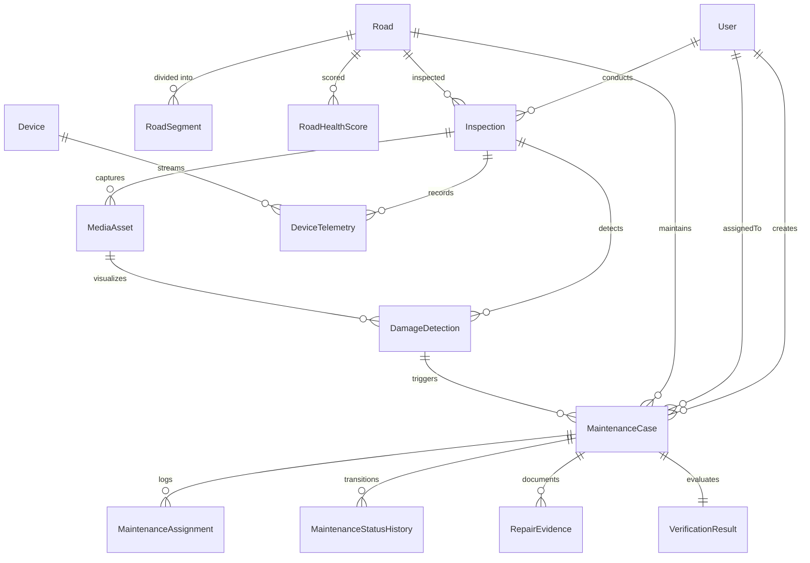

# Sadak Setu — Database Architecture & Schema

Sadak Setu utilizes **PostgreSQL (NeonDB-compatible)** managed through **Prisma ORM**.

## Core Relational Models

## Primary Entities & Roles

### 1. `User` & `RefreshToken`
Stores system accounts with cryptographic password hashes (`bcrypt`, 12 rounds), status tracking (`ACTIVE`, `INACTIVE`, `SUSPENDED`), and active refresh token sessions.

### 2. `Road` & `RoadSegment`
Tracks linear road infrastructure with road codes (`NH-19`, `SH-41`), state, district, block, length in kilometers, and chainage ranges (meters from origin).

### 3. `Inspection` & `MediaAsset`
Encapsulates mobile inspection surveys with inspector ID, survey type (`ROUTINE_SURVEY`, `POST_MONSOON_AUDIT`, etc.), timestamps, and media attachments with GPS tags and storage keys.

### 4. `DamageDetection` & `RoadHealthScore`
AI and inspector findings:
- Categorized as `POTHOLE`, `CRACK`, `SURFACE_DAMAGE`, `EDGE_DAMAGE`.
- Severity levels: `LOW`, `MEDIUM`, `HIGH`, `CRITICAL`.
- Confidence score (0.0 to 1.0) and bounding box JSON.
- Road Health Score (0 - 100) calculated dynamically using calibrated weights.

### 5. `MaintenanceCase`, `MaintenanceStatusHistory` & `VerificationResult`
Operational state machine maintaining immutable audit records for every state change. `VerificationResult` captures before and after images, defect reduction percentage, and supervisor override records.

### 6. `Device` & `DeviceTelemetry`
Captures real-time IoT vibration telematics: accelerometer (X/Y/Z in m/s²), gyroscope, vehicle speed, and computed vibration intensity.

### 7. `AuditLog`
Append-only tamper-evident audit trail capturing user, action, target entity, timestamp, and client IP.
