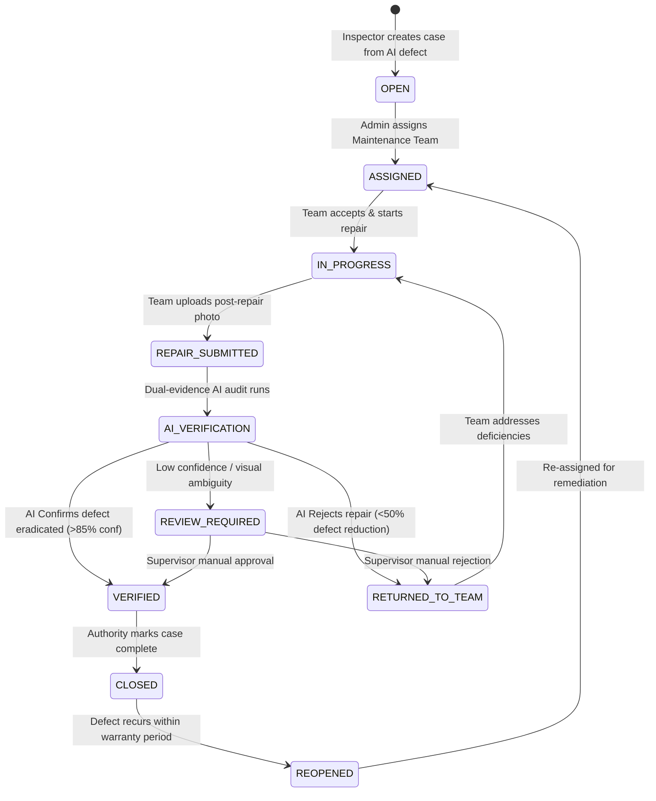

# Sadak Setu — Maintenance Lifecycle & State Machine

Sadak Setu is built upon a deterministic, audited finite state machine. Maintenance cases cannot transition arbitrarily; all status updates require authorization, validation, and historical persistence.

## State Transition Diagram

## State Machine Rules & Roles

| From State | Allowed Next State | Permitted Roles | Required Data / Action |
|---|---|---|---|
| `OPEN` | `ASSIGNED` | `ADMIN` | `teamId`, `expectedCompletionDate` |
| `ASSIGNED` | `IN_PROGRESS` | `MAINTENANCE_TEAM` | On-site arrival confirmation |
| `IN_PROGRESS` | `REPAIR_SUBMITTED` | `MAINTENANCE_TEAM` | `afterMediaUrl`, notes, GPS |
| `REPAIR_SUBMITTED` | `AI_VERIFICATION` | System / Internal | Automatic trigger of comparison |
| `AI_VERIFICATION` | `VERIFIED` | System / AI | High confidence resolution |
| `AI_VERIFICATION` | `RETURNED_TO_TEAM`| System / AI | Defect persists in photo |
| `AI_VERIFICATION` | `REVIEW_REQUIRED` | System / AI | Ambiguous visual delta |
| Any Verification | `VERIFIED` / `RETURNED` | `AUTHORITY`, `ADMIN`| Manual supervisor override with mandatory reason |
| `VERIFIED` | `CLOSED` | `AUTHORITY`, `ADMIN`| Final signoff |

Every transition is appended to `MaintenanceStatusHistory` with the user ID, timestamp, and transition rationale.
